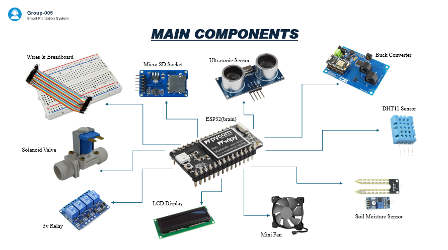

# Smart-Plantation-System
An IoT-based automated plant care system using ESP32 and Blynk

## 🌿 About The Project
The Smart Plantation System automates tasks that would otherwise require constant human involvement. By employing IoT tools and various sensors, it constantly monitors plant health and growing conditions to ensure optimal survival and growth.

**Institution:** Sri Lanka Institute of Information Technology (SLIIT)

**Course:** IT1040 - Fundamentals of Computing

**Team:** Group 05

### 🎯 Key Objectives
* Constantly check temperature, humidity, and soil moisture using specifically placed sensors.
* Automatically control water pumps, fertilizer release, and fans to restore optimal plant conditions.
* Monitor plant height using ultrasonic sensors to determine when the plant is ready to be moved outdoors.
* Send weekly plant health reports as graphs via the Blynk mobile app.

## 🛠️ Hardware Components
* **ESP32:** Acts as the central controller for all connected hardware.
* **Sensors:** Soil moisture sensor, DHT11 sensor (for temperature and humidity), and Ultrasonic sensor (for plant height).
* **Actuators:** Water pumps and fans.
* **Display:** 16x2 I2C LCD display to show plant height.
* **Storage & Power:** SD Card and Power Supply.

## 💻 Software & Technologies
* **Arduino IDE:** Used to write the C++ code to control the ESP32 board and automate plant maintenance.
* **Blynk App:** Used to design the mobile application, connect IoT devices, and generate weekly data reports].

## 📊 System Architecture

## 🧪 Evaluation & Testing
To ensure reliability, we employed several evaluation methods:
* **Functional Testing:** Individual sensor testing for calibration, followed by integrated testing to verify system communication.
* **Accuracy Testing:** Comparing sensor readings against manual measurements taken with traditional tools.
* **User Feedback:** Having selected users interact with the system to ensure it is user-friendly and useful.
